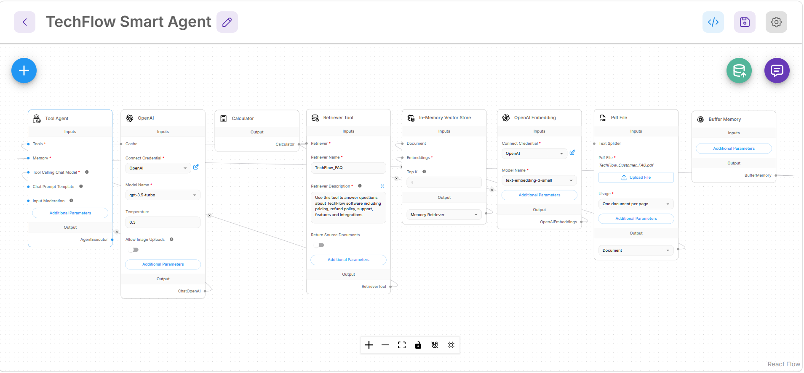

# Advanced AI Agent with Multi-Tool Reasoning

An intelligent Agentic AI system built using Flowise, OpenAI API, vector retrieval, embeddings, memory, and tool routing.

## Features

- RAG-based document retrieval
- OpenAI embeddings + vector store
- Calculator tool integration
- Buffer memory for conversation retention
- Multi-tool reasoning and routing
- Conversational AI workflow
- Out-of-scope query handling

## Tech Stack

- Flowise
- OpenAI API
- Vector Store
- OpenAI Embeddings
- RAG
- Prompt Engineering

## Architecture

This system dynamically selects between:
- Retrieval tools
- Calculator tools
- Conversational memory

based on user queries.

## Project Screenshots

### Advanced AI Agent Architecture

### Multi-Tool Reasoning Output

## Example Capabilities

- Performs mathematical calculations
- Retrieves contextual information from documents
- Remembers previous conversation context
- Handles customer-support style queries
- Refuses unsupported/out-of-scope requests safely

## Portfolio

https://saarika-ai.github.io
